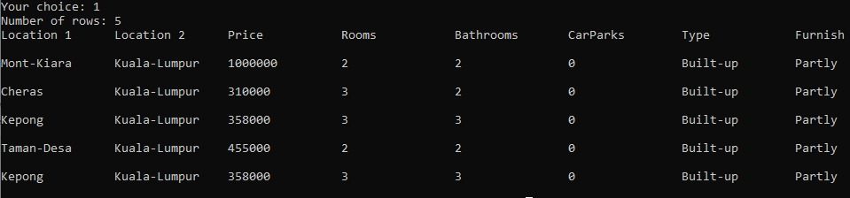
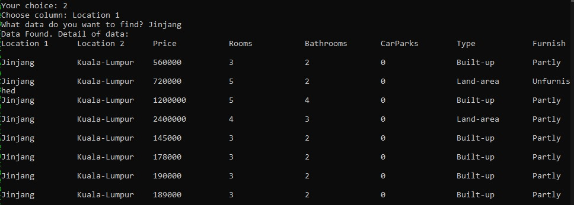
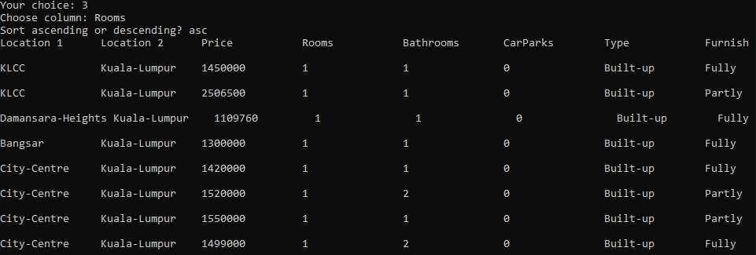

## 📄 CSV Reader (C Language)

A simple C program that allows users to manage and interact with CSV files via the terminal. The program provides functionalities such as:

- 📂 Reading and displaying CSV files
- 🔍 Searching data based on specific criteria
- ↕️ Sorting data by column
- 📤 Exporting processed data to a new CSV file

### 🔧 Built With
- C Programming Language
- Standard C Libraries (stdio.h, stdlib.h, string.h, etc.)

### 💡 Use Case
Perfect for learning file handling in C or managing small CSV-based datasets through a command-line interface.

### 🚀 How to Use
1. Download the "CSV Reader.cpp" file and "file.csv" file first.
2. Compile the source code with a C compiler (Dev C++, etc).
3. Run the executable and follow the menu prompts.

## 🖼️ Screenshot

